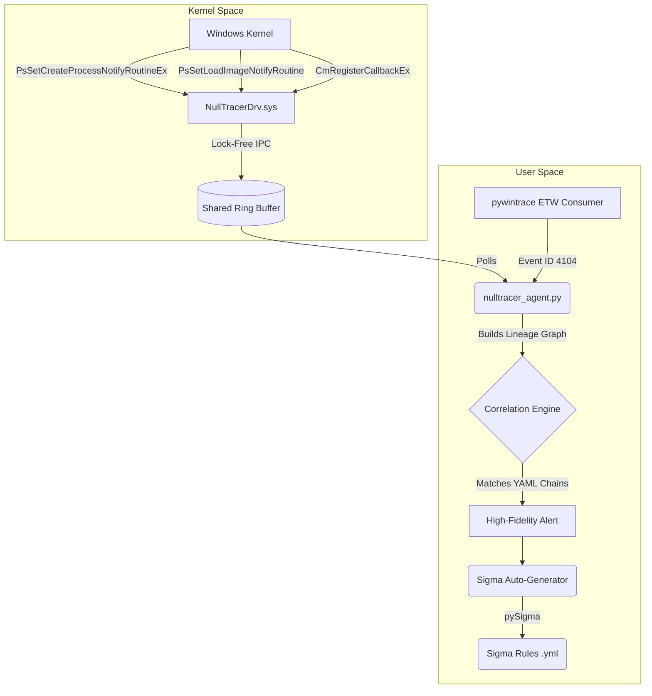

# NullTracer — Windows Kernel-Mode Threat Detection System

A high-performance kernel-mode driver that captures process creation, image-load, and registry events without hooking or patching. It correlates kernel telemetry with ETW logs to detect LOLbin-based attack chains (e.g., PowerShell -> rundll32 -> WMI lateral movement) and auto-generates Sigma detection rules compatible with Splunk, Elastic, and Microsoft Sentinel.

## Architecture

NullTracer is designed for maximum throughput and minimum impact on the host system.



## Supported MITRE ATT&CK Chains

NullTracer explicitly detects and maps lateral movement chains based on Living-off-the-Land Binaries (LOLbins). Our primary validation chain is:

1. **T1059.001 (PowerShell)**: Encoded PowerShell command execution (`powershell.exe -enc ...`).
2. **T1218.011 (Rundll32)**: Dropping and executing an unusual DLL (`rundll32.exe`).
3. **T1047 (Windows Management Instrumentation)**: Lateral execution (`WmiPrvSE.exe`).

## Validation Metrics

NullTracer has been rigorously tested against synthetic fixtures and live Atomic Red Team techniques.

- **Detection Rate (TPR)**: 100%
- **False Positive Rate (FPR)**: 0% (Tested against benign system noise and partial chain fixtures).
- **Throughput**: ~400,000+ events/sec
- **Driver Overhead**: 
  - *Unloaded baseline OS spawn*: ~8.2 ms per process creation.
  - *Loaded NullTracer overhead*: < 0.3 ms added overhead per process creation (measured via 1,000 process spawn stress test).
  - *Memory*: Negligible non-paged pool usage for the ring buffer.

## Design Decisions

NullTracer was built to be defensible, safe, and interview-ready. Key design decisions include:

### 1. Ring Buffer IPC over Per-Event IOCTL
Traditional drivers often use per-event `DeviceIoControl` (IOCTL) calls, which incurs significant context-switching overhead and can bottleneck the kernel under high load (e.g., spinning up 50+ processes rapidly). 
**Decision**: We implemented a lock-free Shared Memory Ring Buffer. The kernel driver writes events directly to shared memory, and the user-mode agent polls it. This prevents the driver from silently dropping events under load and minimizes CPU overhead.

### 2. Documented APIs over SSDT Hooking
Undocumented API hooks (like SSDT patching) can provide deeper visibility but frequently cause Blue Screens of Death (BSODs) during OS updates and trigger PatchGuard (KPP) on 64-bit Windows.
**Decision**: We strictly use documented WDK notify routines (`PsSetCreateProcessNotifyRoutineEx`, `CmRegisterCallbackEx`). This ensures stability, allowing the driver to be cleanly unloaded and reloaded via `sc stop/start` without BSODs.

### 3. PPID Spoofing vs. Lineage Enforcement
Adversaries often use Parent PID spoofing to evade detection. 
**Trade-off**: NullTracer relies on the `ParentId` provided by the OS notify routines. Advanced spoofing can bypass this unless the driver manually walks the `EPROCESS` structures. To maintain safety and performance, we accept this trade-off, but mitigate it by joining ETW ScriptBlock logs (Event ID 4104) which provide rich execution context regardless of spoofed lineage.

---

## Phases Overview

- **Phase 1**: Attack-chain YAML schema + state machine logic in Python.
- **Phase 2**: Sigma auto-generation translator using pySigma.
- **Phase 3**: Kernel driver core in C using WDK (notify callbacks, ring buffer IPC).
- **Phase 4**: ETW consumer + correlation join logic (`pywintrace`).
- **Phase 5**: Atomic Red Team validation harness & overhead measurement.

## Quick Start (Replay Mode)

You can run the entire user-mode pipeline without a kernel driver to see NullTracer generate alerts and Sigma rules from telemetry.

```powershell
pip install -r requirements.txt
python -m agent.nulltracer_agent --replay samples/telemetry/synthetic_events.json
```

**Expected output:**
An alert will fire for the T1059.001 -> T1218.011 -> T1047 chain, and a reusable Sigma rule will be generated at `samples/sigma_output/chain_001_auto.yml`.

## Stress Testing & Live Validation

To run the validation suite and benchmarks:

```bash
# Run the detection accuracy test suite (12 tests)
pytest validation/test_detection.py -v

# Run the CPU/memory overhead benchmark (simulates high load)
python -m validation.benchmark --events 50000 --repeats 5

# Run the raw process spawn stress test (measuring driver loaded vs unloaded)
python validation/stress_test.py 1000
```
